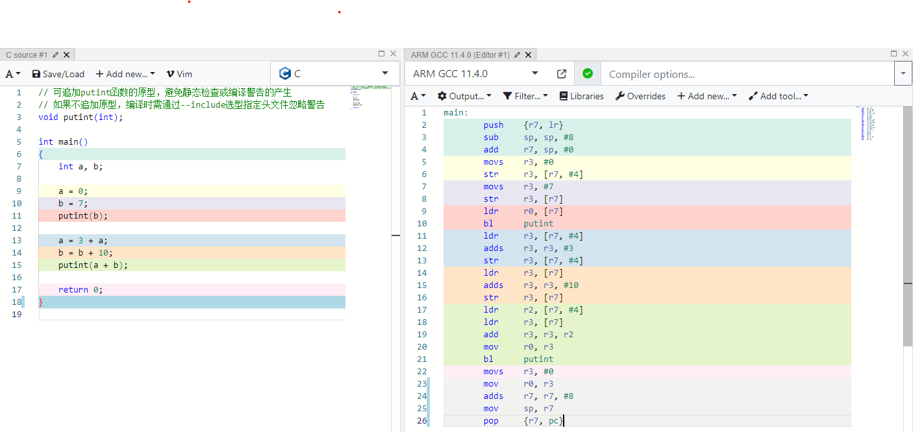

# MiniC编译器

## 目前编译器实现的功能

编译器的代码通过git管理，可直接在<https://github.com/NPUCompiler/calculator>上查看。

可通过git从<https://github.com/NPUCompiler/calculator.git>上克隆到本地进行使用。

### 基本版功能

实现的功能为支持main函数的定义、return语句、非负整数常量的支持。

这部分功能体现在git的minic-basic分支上，请切换到本分支上进行程序构建与运行。

### 加强版功能

在基本版的功能上支持局部int类型的变量定义、支持变量和非负整数常量的加减表达式、赋值语句、语句块、变量作用域的分层管理、putint内置函数的支持等。

这部分功能体现在git的minic-expr分支上，请切换到本分支上进行程序构建与运行。

## 编译器的命令格式

命令格式：
MiniC -S [-A | -D] [-T | -I] [-o output] [-O level] [-t cpu] source

选项-S为必须项，默认输出汇编。

选项-O level指定时可指定优化的级别，0为未开启优化。
选项-o output指定时可把结果输出到指定的output文件中。
选项-t cpu指定时，可指定生成指定cpu的汇编语言。

选项-A 指定时通过 antlr4 进行词法与语法分析。
选项-D 指定时可通过递归下降分析法实现语法分析。
选项-A与-D都不指定时按默认的flex+bison进行词法与语法分析。

选项-T指定时，输出抽象语法树，默认输出的文件名为ast.png，可通过-o选项来指定输出的文件。
选项-I指定时，输出中间IR(DragonIR)，默认输出的文件名为ir.txt，可通过-o选项来指定输出的文件。
选项-T和-I都不指定时，按照默认的汇编语言输出，默认输出的文件名为asm.s，可通过-o选项来指定输出的文件。

## 源代码构成

frontend 目录下的源代码实现编译器的前端，有三种：flex/bison、antlr4、递归下降分析法

backend 目录下的源代码实现编译器的后端，有两种：解释执行或转换成 ARM32 汇编

DragonIR 目录下的源代码描述规定的线性 IR

common 目录下的源代码描述符号表或共通的代码

utils 目录下的源代码实现个别函数的操作系统差异

tests 目录下放置了一些简单的测试用例代码

thirdparty 目录下放置了一些第三方的工具，如 antlr4.12.0

## 程序构建

请使用VSCode + WSL/Container/SSH + Ubuntu 22.04进行编译与程序构建。

在使用前请确认已经安装clang-format、clang-tidy和clangd。
这样VSCode可根据文件夹下的.clang-format和.clang-tidy进行代码分析，提示一下警告错误或者格式化调整。

具体请搜索相关信息修改.clang-format和.clang-tidy的内容。

安装命令格式如下：

```shell
sudo apt install -y clang-format clang-tidy clangd
```

### cmake插件构建

请根据vscode的提示，安装推荐的插件。若没有，可自行查找.vscode/extensions.json的插件手动安装。

使用VScode的cmake插件直接先选择clang编译器后进行程序的构建。

### 命令行构建

```shell
# cmake根据CMakeLists.txt进行配置与检查，这里使用clang编译器并且是Debug模式
cmake -B cmake-build-debug -S . -DCMAKE_BUILD_TYPE=Debug -DCMAKE_CXX_COMPILER:FILEPATH=/usr/bin/clang++
# cmake，其中--parallel说明是并行编译
cmake --build cmake-build-debug --parallel
```

## 使用方法

在Ubuntu 22.04平台上运行。支持的命令如下所示：

```shell

./cmake-build-debug/MiniC -S -T test.txt

./cmake-build-debug/MiniC -S -T -A test.txt

./cmake-build-debug/MiniC -S -T -D test.txt

./cmake-build-debug/MiniC -S -T -o test.pdf test.txt

./cmake-build-debug/MiniC -S -T -A -o test.pdf test.txt

./cmake-build-debug/MiniC -S -T -D -o test.pdf test.txt

./cmake-build-debug/MiniC -S -I test.txt

./cmake-build-debug/MiniC -S -I -A test.txt

./cmake-build-debug/MiniC -S -I -D test.txt

./cmake-build-debug/MiniC -S -I -o ir.txt test.txt

./cmake-build-debug/MiniC -S -I -A -o ir.txt test.txt

./cmake-build-debug/MiniC -S -I -D -o ir.txt test.txt
```

## 工具

本实验的所有工具或软件在实验一中已经安装，这里不需要再次安装。这里主要介绍一些功能。

### Flex 与 Bison

#### Windows

在Widnows平台上请使用MinGW进行开发，不建议用 Visual Studio。若确实想用，请用win_flex和win_bison工具。

#### MinGW、Linux or Mac

flex -o MiniC_lex.cpp --header-file=MiniC_lex.h MiniC.l

bison -o MiniC_yacc.cpp --header=MiniC_yacc.h -d MiniC.y

请注意 bison 的--header 在某些平台上可能是--defines，要根据情况调整指定。

### Antlr 4.12.0

要确认java15 以上版本的 JDK，否则编译不会通过。默认已经安装了JDK 17的版本。

由于cmake的bug可能会导致适配不到15以上的版本，请删除旧版的JDK。

编写 g4 文件然后通过 antlr 生成 C++代码，用 Visitor 模式。

```shell
java -jar tools/antlr-4.12.0-complete.jar -Dlanguage=Cpp -no-listener -visitor -o frontend/antlr4 frontend/antlr4/MiniC.g4
```

C++使用 antlr 时需要使用 antlr 的头文件和库，在 msys2 下可通过如下命令安装 antlr 4.12.0 版即可。

```shell
pacman -U https://mirrors.ustc.edu.cn/msys2/mingw/mingw64/mingw-w64-x86_64-antlr4-runtime-cpp-4.12.0-1-any.pkg.tar.zst
```

### Graphviz

借助该工具提供的C语言API实现抽象语法树的绘制。

### doxygen

借助该工具分析代码中的注释，产生详细分析的文档。这要求注释要满足一定的格式。具体可参考实验文档。

### texlive

把doxygen生成的文档转换成pdf格式。

## 根据注释生成文档

请按照实验的文档要求编写注释，可通过doxygen工具生成网页版的文档，借助latex可生成pdf格式的文档。

请在本实验以及后续的实验按照格式进行注释。

### 生成网页版文档

```shell
doxygen Doxygen.config
```

需要时可自行修改配置文件 Doxygen.config。

### 生成 pdf格式的文档

```shell
cd latex
make
```

## 实验运行

tests 目录下存放了一些简单的测试用例。

由于 qemu 的用户模式在 Window 系统下不支持，因此要么在真实的开发板上运行，或者用 Linux 系统下的 qemu 来运行。

### 调试运行

由于自定的gdb或者lldb调试器对C++的STL模版库提供的类如string、map等的显示不够友好，因此请大家确保安装
vadimcn.vscode-lldb插件，也可以更新最新的代码后vscode会提示安装推荐插件后自动安装。

如安装不上请手动下载后安装，网址如下：
<https://github.com/vadimcn/codelldb/releases/>

调试运行配置可参考.vscode/launch.json中的配置。

### 生成中间IR(DragonIR)与运行

前提需要下载并安装IRCompiler工具。

```shell
# 翻译 test1-1.c 成 ARM32 汇编
./cmake-build-debug/MiniC -S -I -o tests/test1-1.ir tests/test1-1.txt
./IRCompiler -R tests/test1-1.ir
```

第一条指令通过minic编译器来生成的汇编test1-1.ir
第二条指令借助IRCompiler工具实现对生成IR的解释执行。

### 生成 ARM32 的汇编

```shell
# 翻译 test1-1.c 成 ARM32 汇编
./cmake-build-debug/MiniC -S -o tests/test1-1-0.s tests/test1-1.c
# 把 test1-1.c 通过 arm 版的交叉编译器 gcc 翻译成汇编
arm-linux-gnueabihf-gcc -S -include tests/std.h -o tests/test1-1-1.s tests/test1-1.c
```

如果不指定--include tests/std.h，编译会提示函数 putint 没有声明的警告信息。

第一条命令通过minic编译器来生成的汇编test1-1-0.s
第二条指令是通过arm-linux-gnueabihf-gcc编译器生成的汇编语言test1-1-1.s。

在调试运行时可通过对比检查所实现编译器的问题。

### 生成可执行程序

通过 gcc 的 arm 交叉编译器对生成的汇编进行编译，生成可执行程序。

```shell
# 通过 ARM gcc 编译器把汇编程序翻译成可执行程序，目标平台 ARM32
arm-linux-gnueabihf-gcc -static -g -o tests/test1-1-0 tests/std.c tests/test1-1-0.s
# 通过 ARM gcc 编译器把汇编程序翻译成可执行程序，目标平台 ARM32
arm-linux-gnueabihf-gcc -static -g -o tests/test1-1-1 tests/std.c tests/test1-1-1.s
```

有以下几个点需要注意：

1. 这里必须用-static 进行静态编译，不依赖动态库，否则后续通过 qemu-arm-static 运行时会提示动态库找不到的错误
2. 生成的汇编中包含了 内置 putint 等函数的调用，用来进行数据的输出或输出等，因此在通过 arm-linux-gnueabihf-gcc 进行交叉编译时，需要和 std.c 一起进行编译链接才可以。
3. 可通过网址<https://godbolt.org/>输入 C 语言源代码后查看各种目标后端的汇编。下图是选择 ARM GCC 11.4.0 的源代码与汇编对应。

4. 这些内置函数的具体实现放在了 tests/std.c 中，其原型在 tests/std.h 中，很简单，请自行查阅与理解。

### 运行可执行程序

借助用户模式的 qemu 来运行，arm 架构可使用 qemu-arm-static 命令。

```shell
qemu-arm-static tests/test1-1-0
qemu-arm-static tests/test1-1-1
```

这里可比较运行的结果，如果两者不一致，则编写的编译器程序有问题。

如果测试用例源文件程序需要输入，假定输入的内容在文件A.in中，则可通过以下方式运行。

```shell
qemu-arm-static tests/test1-1-0 < A.in
qemu-arm-static tests/test1-1-1 < A.in
```

如果想把输出的内容写到文件中，可通过重定向符号>来实现，假定输入到B.out文件中。

```shell
qemu-arm-static tests/test1-1-0 < A.in > A.out
qemu-arm-static tests/test1-1-1 < A.in > A.out
```

## qemu 的用户模式

qemu 的用户模式下可直接运行交叉编译的用户态程序。这种模式只在 Linux 和 BSD 系统下支持，Windows 下不支持。

因此，为便于后端开发与调试，请用 Linux 系统进行程序的模拟运行与调试。

## qemu 用户程序调试

### 安装 gdb 调试器

该软件 gdb-multiarch 在前面工具安装时已经安装。如没有，则通过下面的命令进行安装。

```shell
sudo apt-get install -y gdb-multiarch
```

### 启动具有 gdbserver 功能的 qemu

假定通过交叉编译出的程序为 tests/test1，执行的命令如下：

```shell
# 启动 gdb server，监视的端口号为 1234
qemu-arm-static -g 1234 tests/test1
```

其中-g 指定远程调试的端口，这里指定端口号为 1234，这样 qemu 会开启 gdb 的远程调试服务。

### 启动 gdb 作为客户端远程调试

建议通过 vscode 的调试，选择 Qemu Debug 进行调试，可开启图形化调试界面。
可根据需要修改相关的配置，如 miDebuggerServerAddress、program 等选项。

也可以在命令行终端上启动 gdb 进行远程调试，需要指定远程机器的主机与端口。
注意这里的 gdb 要支持目标 CPU 的 gdb-multiarch，而不是本地的 gdb。

```shell
gdb-multiarch tests/test1
# 输入如下的命令，远程连接 qemu 的 gdb server
target remote localhost:1234
# 在 main 函数入口设置断点
b main
# 继续程序的运行
c
# 之后可使用 gdb 的其它命令进行单步运行与调试
```

在调试完毕后前面启动的 qemu-arm-static 程序会自动退出。因此，要想重新调试，请启动第一步的 qemu-arm-static 程序。


## 实用脚本说明

tools文件夹下有以`.sh`结尾的脚本文件，可以便捷地帮我们执行一些重复操作。

脚本文件使用前可能需要使用如下指令来给脚本赋予权限。

```bash
chmod +x name.sh
```

在实验的过程中，也可以根据自己的需要实时修改增加脚本，提升自己的开发效率（自己不会写可以让ai帮忙写）。


### 抽象语法树生成脚本

当然，也可以把下面三个脚本集成为一个脚本`ast.sh`，通过`tools/ast.sh FB/A/D test`来使用脚本。

#### FBast.sh

用于便捷测试抽象语法树的脚本,读取tests/test.c文件，生成抽象语法树.png，保存到result文件夹下(如果不存在，则自动创建)。

使用指令 "chmod +x ./tools/FBast.sh" 给脚本权限

使用方式 ./tools/FBast.sh test 

且test应在/minic/tests目录下,test为测试输入文件、输出图片的名字 不需要包含.c的后缀 

使用实例： "./tools/FBast.sh test1-1"

"FBast.sh" 中的FB表示使用 flex bison

#### Aast.sh

用于便捷测试抽象语法树的脚本,读取tests/test.c文件，生成抽象语法树.png，保存到result文件夹下(如果不存在，则自动创建)。

使用指令 "chmod +x ./tools/Aast.sh" 给脚本权限

使用方式 ./tools/Aast.sh test 

且test应在/minic/tests目录下,test为测试输入文件、输出图片的名字。不需要包含.c的后缀 

使用实例： "./tools/Aast.sh test1-1"

"Aast.sh" 中的A表示使用 antlr

#### Dast.sh

用于便捷测试抽象语法树的脚本,读取tests/test.c文件，生成抽象语法树.png，保存到result文件夹下(如果不存在，则自动创建)。

使用指令 "chmod +x ./tools/Dast.sh" 给脚本权限

使用方式 ./tools/Dast.sh test 

且test应在/minic/tests目录下,test为测试输入文件、输出图片的名字。不需要包含.c的后缀 

使用实例： "./tools/Dast.sh test1-1"

"Dast.sh" 中的D表示使用 递归下降分析法
